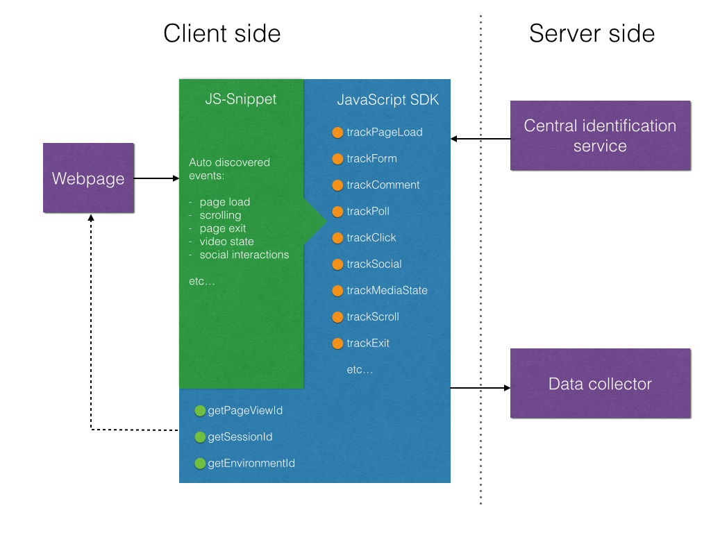

# Difference between JS-Snippet and JS-SDK

The [JS-SDK-Event-Tracking repository](https://github.com/schibsted/sdk-js-event-tracking) repository (JS-SDK) is the actual SDK. The SDK doesn’t track events automatically. The SDKs function is to provide IDs, functions for creating activitystream events and for transferring those events to a “data collector”. The SDK is meant to be extended in order to track data. One such extension is the tracking-snippet.

The [JS-SDK-Event-Tracking-contrib](https://github.com/schibsted/sdk-js-event-tracking-contrib) repository (JS-Snippet) is an automatic tracking software. It builds on and includes the SDK. It has several kind of event listeners, and can be included in an existing site with a minimum of effort needed by the person implementing it.

To see the events being produced by the snippet. Visit the [events page](https://github.com/schibsted/sdk-js-event-tracking-contrib/blob/master/EVENTS.md).



# Getting started

This is a three step guide to get started.

1. Put the Snippet found [here](https://github.com/schibsted/sdk-js-event-tracking-contrib#getting-started) in your page.
2. Provide values to the `_opt` object as demonstrated [here](https://github.com/schibsted/sdk-js-event-tracking-contrib#example-of-recommended-implementation)
3. Add any other [options](https://github.com/schibsted/sdk-js-event-tracking-contrib#optional-options) you need to the `_opt` object.

# Snippet

To get started with automatic tracking, please insert the following snippet as close to `</body>` as possible.

```
<script type="text/javascript">
var _opt = {
    pageId: /* a unique ID for the current page */,
    clientId: /* your clientId (e.g VG, BT etc) */
};

(function(){
    var d=document, g=d.createElement('script'), s=d.getElementsByTagName('script')[0];
    g.src="//cdn.spid.se/sdk/autoTracker.min.js";
    s.parentNode.insertBefore(g,s);
})();
</script>
```

If you use any third party libraries for module loading (such as requirejs), you might have some issues with the current version of autoTracking. The recommendation in such case is to make your own implementation using the bare JS-SDK until an alternative is available.

# Options

Options can be set in the `_opt` object in the tracking snippet.

## Required options

There are only two required options to be set in the `_opt` object.

`clientId` - a string representing your organization, such as `VG` or `BT`

## Recommended options

`userId` - If the user has a userId, please provide this as an option. The user must have agreed to terms and condition

`pageId` - a unique string for the current page/article/ad/view. If not provided, the SDK will use `document.location` as pageId.

Category - Category is not an option itself, but it should go in to the provider as demonstrated below.

### Example of recommended implementation

```
<script type="text/javascript">
var _opt = {
    pageId: 908123112, 			// String or integer
    clientId: 'Example', 		// String
	userId: 987841231, 			// String or integer
	provider: {					// Key/Value pairs. Keep keys in camel case
		category: 'cars',
		subCategory: 'ford',
		yourKey: 'yourValue'
	}
};

(function(){
    var d=document, g=d.createElement('script'), s=d.getElementsByTagName('script')[0];
    g.src="//cdn.spid.se/sdk/autoTracker.min.js";
    s.parentNode.insertBefore(g,s);
})();
</script>
```

## Optional options

The following options can be set:

`pageType` - The type of page ('Page', 'Article', 'Application', 'Community', 'Service'). Should always be a valid Activitystreams 2.0 object type. (http://www.w3.org/TR/2015/WD-activitystreams-vocabulary-20150129/)

`provider` - If you want to input meta to the provider field of the generated event, you can do so by passing an object to this property.

`respectDoNotTrack` - If you want the tracking script to respect users who have set the doNotTrack flag, please set this option to `true`. Otherwise, the doNotTrack flag will not be respected.

`transport` - A object for transporting data from/to the identity service (CIS) and the data-collector. A default i provided from the SDK, so leave this one out unless you know what you are doing.

`url` - If you want your data sent to an alternative data-collector instead of the SPT data-collector, specify the URL to you API end point here.

`userIdDomain` - Please provide this property with a string defining the origin of your userIds (domain). Otherwise, the tracking software will assume that any userIds you pass with the `loginEvent` function or as a `userId` option have originated from schibsted.com

`visitorId` - VisitorIds should normally be provided by CIS, but if you for some reason need to set your own (tests or such), you can use this option.

# Get/set functions.

All calls to get/set functions should be done after pageload is complete.

`AutoTrack.getPageViewId()` - returns the pageViewId for the page view.

`AutoTrack.getSessionId()` - returns the sessionId for the visit. The session ID might need a bit longer than page load before it can be exposed due to AJAX-requests that are sent for this ID.

`AutoTrack.getVisitorId()` - returns the visitorId of the user. This ID is likely to stay the same across sessions. But will change if the user is logged in or out. The visitor ID might need a bit longer than page load before it can be exposed due to AJAX-requests that are sent for this ID.

`AutoTrack.logoutEvent()` - If a logged in user logs out, this function should be called. It will trigger a request for a new set of IDs.

`AutoTrack.loginEvent(userId)` - If a logged out user logs in, this function should be called. It takes a `userId`, which is passed on to CIS as well as stored in a local cookie. The user must have accepted terms and conditions for the identity provider or any similar ToC where the user agrees to being tracked.

# Events that are tracked by default

The following events are tracked by default:

Pageload

scroll (25% intervals),

Facebook likes / removed likes - Your implementation of Facebook like button must be the current recommended implementation from Facebook.

Twitter sharing - Your implementation of Twitter share button must be the current recommended implementation from Twitter.

PageUnload - Experimental

# Additional supported events

## Track Visibility

If the class `track-visibility` is set on any element, an event will be produced whenever that element enters and exits the viewport.

The element needs to have an `id` parameter set as well in order to provide identification of the element. The `id` parameter should be unique for the page.

## Track Click

If the class `track-click` is set on any element, an event will be produced whenever that element, or a child element is clicked.

The element needs to have an `id` parameter set as well in order to provide identification of the element. The `id` parameter should be unique for the page.

## Track Form

If the class `track-form` is set on any element, an event will be produced if the element produces an `onsubmit` event.

The element needs to have an `id` parameter set as well in order to provide identification of the element. The `id` parameter should be unique for the page.

## Track Comment

If the class `track-comment` is set on any element, an event will be produced if the element produces an `onsubmit` event.

The element needs to have an `id` parameter set as well in order to provide identification of the element. The `id` parameter should be unique for the page.

## Track Poll

If the class `track-poll` is set on any element, an event will be produced if the element produces an `onsubmit` event.

The element needs to have an `id` parameter set as well in order to provide identification of the element. The `id` parameter should be unique for the page.
